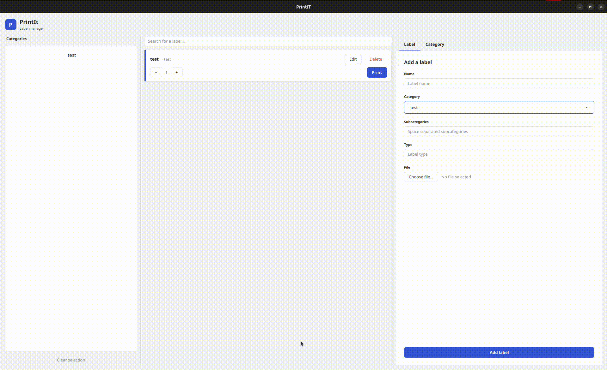

<div align="center">

# PrintIT

An efficient label printing solution for businesses that need to manage and print labels regularly.

<div align="center">


</div>

</div>

---

## Demo

<div align="center">
    
</div>

---

## Key Features

- **Organized Label Management**: Keeps all labels categorized, making it easy to stay organized.
- **Improved Efficiency**: Search and print labels without manually searching through complex file systems.
- **Scalable**: Easily add new categories and labels as your product line grows.
- **SQLite Integration**: Uses a lightweight SQLite database for data storage, supporting offline operation to ensure business continuity during network outages.
- **Customizable Printing**: Features an intelligent printer service that determines paper source and destination based on label type, reducing time spent interacting with print dialogs.

---

## Purpose

When I worked at a small local business, one of our main tasks was to print labels that would go on the products we sold. The files for the labels were scattered throughout the computer's file system, there were inexplicably duplicate labels, and some labels were even outdated.

Printing one or two of these on occasion was not a big deal. However, during the holiday season, we would need to print dozens of these labels every day. As you can imagine, this slowed down how fast we could put out the product and made a worker unavailable for the time being.

Thus, I wanted something more efficient and organized.

Every design decision keeps in mind the goal of efficiency and organization. While I was still working at the business, this reduced my time to print labels by about **50%**. I was able to get what I needed printed much faster, which allowed me to help more customers.

---

## Technologies Used

- **Java**: The core programming language used for logic.
- **JavaFX/FXML**: Used to build a responsive, maintainable, and easily stylable user interface.
- **SQLite**: The underlying database management system for storing and querying label data.

For more information, refer to the [Business Overview](https://github.com/Implycitt/PrintIt/blob/main/Documents/PrintIT.pdf)

---

## How to Build and Run

To build and run the project using Maven, ensure you have [Java](https://www.java.com/en/) and [Maven](https://maven.apache.org/) installed.

```bash
# Build the project
mvn clean install

# Run the project
mvn javafx:run
```

Alternatively, you can download the [latest release](https://github.com/Implycitt/PrintIt/releases).
